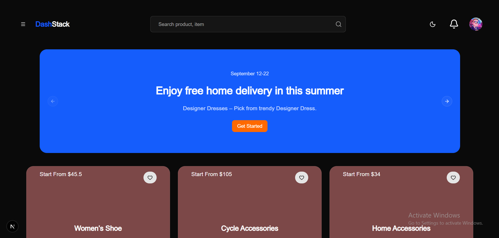
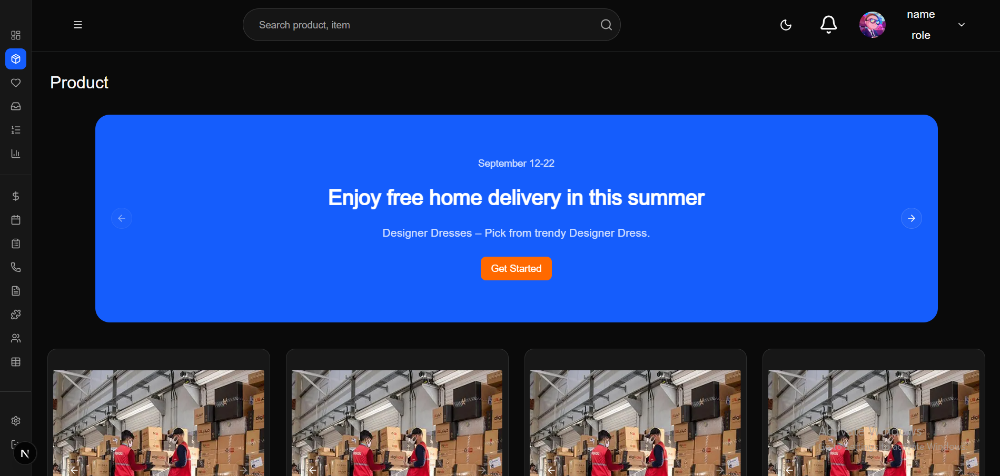
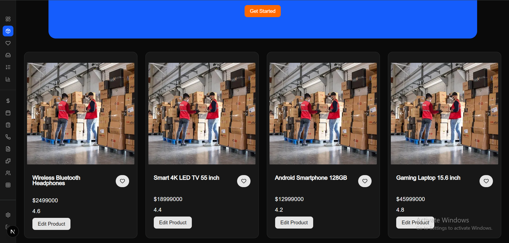
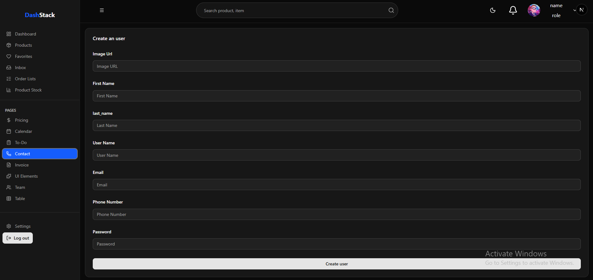
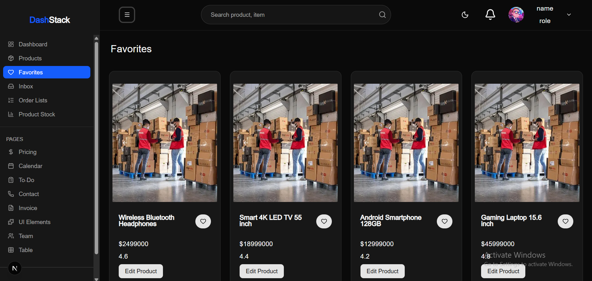

# Full-Stack App: Next.js + Golang Fiber

> 🚧 **Work in Progress** – This project is actively being developed.  
> Backend core functionality is largely complete; frontend is currently UI-only for several sections.

A full-stack web application built with **Next.js (TypeScript)** and **Golang (Fiber)**.  
Features JWT authentication, role‑based access control (RBAC), and CRUD operations for products, users, and roles.

---

## 🎯 Current Status

### ✅ Backend (Go/Fiber)

- **Auth** – Registration, Login, JWT (HTTP‑only cookies), password hashing (bcrypt)
- **User & Role Management** – Admin can create/update users and assign roles (Admin/User)
- **Products** – Create, read, update, delete (CRUD) with proper validation
- **Middleware** – Protected routes, RBAC middleware
- **Database** – GORM with PostgreSQL/MySQL
- **Remaining** – Orders, CSV export, and advanced features are still being implemented.

### 🎨 Frontend (Next.js/TypeScript)

- **Landing Page** – Fully designed (UI only, not yet connected to API)
- **Dashboard** – Layout and components ready (UI only)
- **Products Page** – Product listing and detail view (UI only)
- **Favorites** – Favorite items page (UI only)
- **Auth Pages** – Login & Register forms not yet wired up completely
- **Overall** – Core UI structure exists, API integration is in progress.

---

## 📸 Screenshots

### 🏠 Landing Page

<p align="center">
  
</p>

### 🛍️ Products

<p align="center">
  
  
</p>

### Contact

<p align="center">
  
</p>

### ⭐ Favorites

<p align="center">
  
</p>

---

## 🛠 Tech Stack

**Frontend**

- Next.js (App Router)
- TypeScript
- Tailwind CSS
- React Hook Form + Zod
- pnpm

**Backend**

- Golang 1.25
- [Fiber](https://gofiber.io/)
- GORM
- JWT
- PostgreSQL

---

## 🚀 Getting Started (for development)

### Backend

```bash
cd backend
go mod tidy
# Configure your .env file (DB_URL, JWT_SECRET)
go run main.go


Frontend


cd frontend
pnpm install
pnpm dev
```
